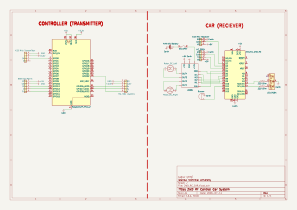
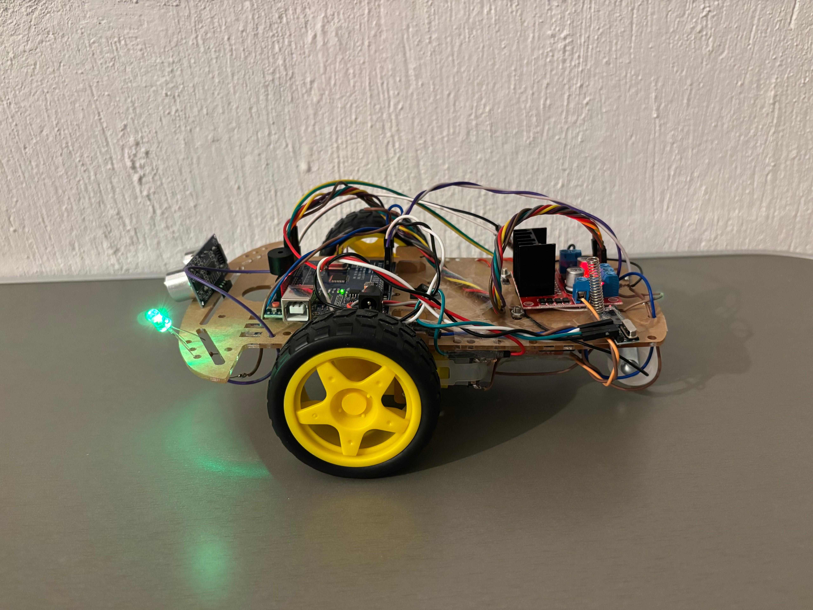
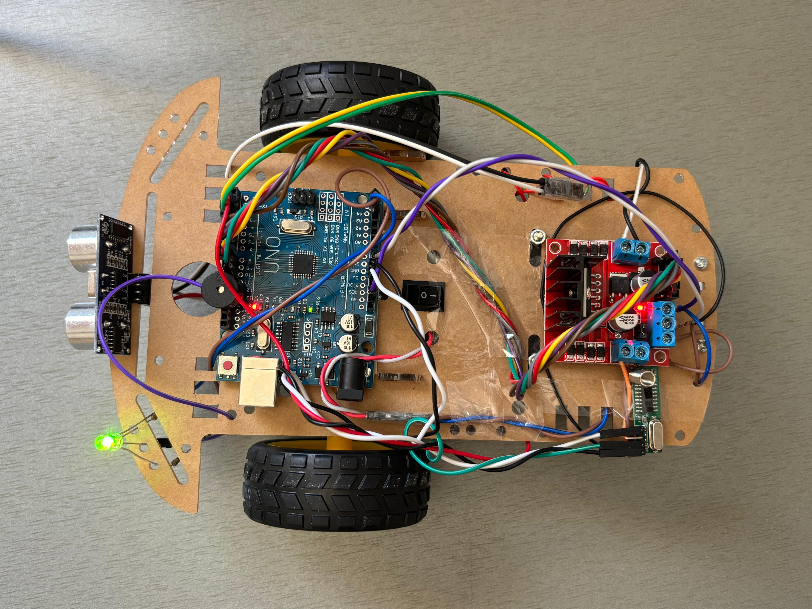
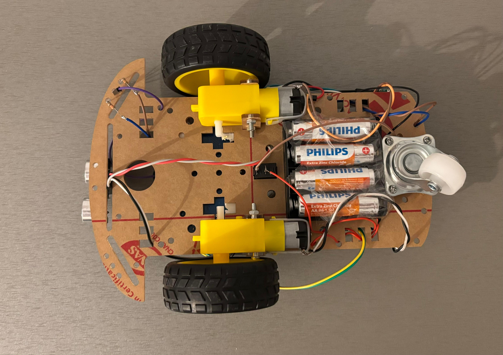
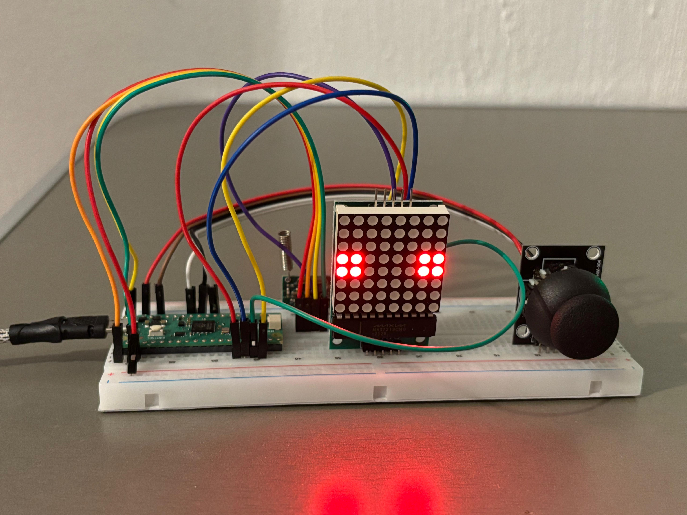

# RF-Controlled RC Car System

This project is an RF-controlled RC car system. The system has a remote controller (Transmitter) and the car (Receiver). 

The controller uses a Raspberry Pi Pico 2 to read joystick movements and sends them via a 433 MHz RF module. The car uses an Arduino Uno to receive these signals and drive the motors using an L298N motor driver. The car also has a distance sensor and an RGB LED for feedback.

## Features
* **Wireless Control:** Uses 433 MHz RF modules for communication.
* **Motor Control:** L298N driver for dual DC motors.
* **Obstacle Detection:** HC-SR04 ultrasonic sensor to prevent crashes.
* **Visual & Audio Feedback:** RGB LED and Buzzer for alerts.
* **Display:** 8x8 Dot Matrix on the controller to show motors' status.

---

## Bill of Materials

### Remote Controller (Transmitter)
| Qty | Component | Purpose |
| :---: | :--- | :--- |
| 1 | Raspberry Pi Pico 2 | Main controller. Reads joystick and sends RF data. |
| 1 | HW-504 Joystick Module | Provides analog (X-Y) and digital (SW) inputs. |
| 1 | 8x8 Dot Matrix (MAX7219) | SPI display to show status. |
| 1 | 433 MHz RF Transmitter | Sends data wirelessly to the car's module. |

### RC Car (Receiver)
| Qty | Component | Purpose |
| :---: | :--- | :--- |
| 1 | Arduino Uno R3 | Main controller for the car. |
| 1 | L298N Motor Driver | Controls the speed and direction of the DC motors. |
| 1 | 433 MHz RF Receiver | Receives commands from the controller. |
| 2 | Yellow DC Gear Motor | Drives the wheels. |
| 1 | HC-SR04 Ultrasonic Sensor | Measures distance to avoid obstacles. |
| 1 | Common Cathode RGB LED | Shows visual status of distance. |
| 1 | Buzzer | Makes warning sounds. |
| 1 | 4xAA Battery Holder (6V) | Main power supply for the system. |
| 1 | SPST Toggle Switch | Main power ON/OFF switch. |

---

## Circuit Diagram
**The detailed KiCad schematic in the repository:**

---

## Gallery

**Car (Receiver)**

**Top View**

**Bottom View**

**Controller (Transmitter)**

---
*Developed by Çağlar Çerçi.*
